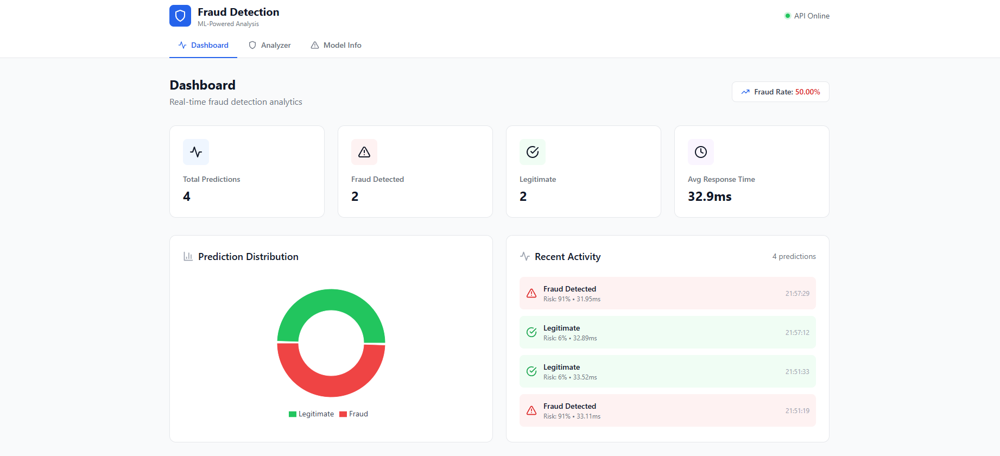
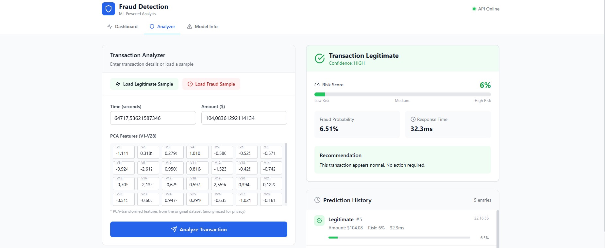
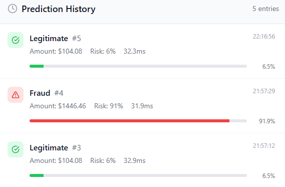
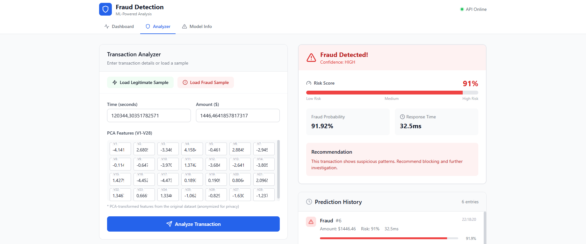
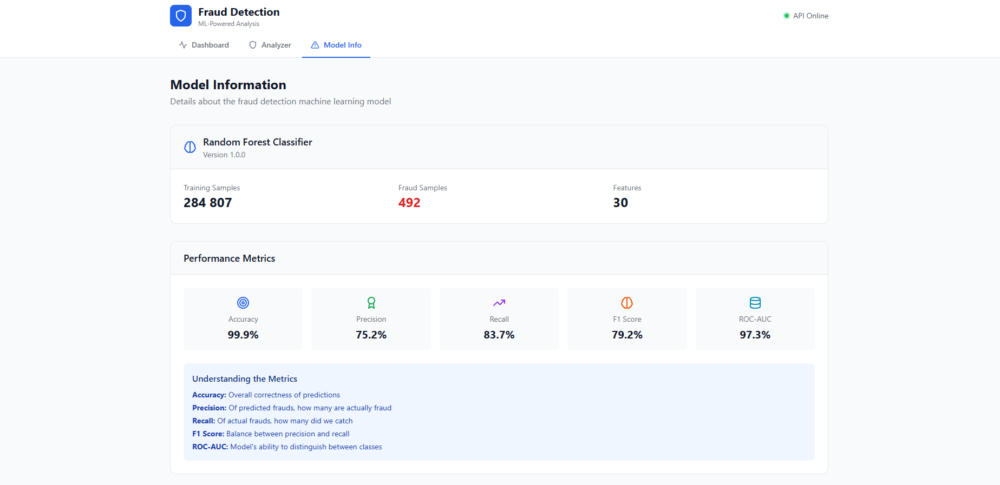
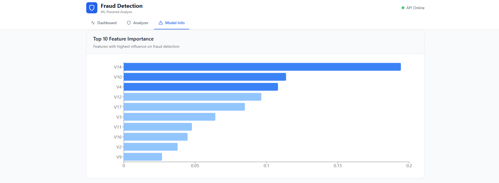
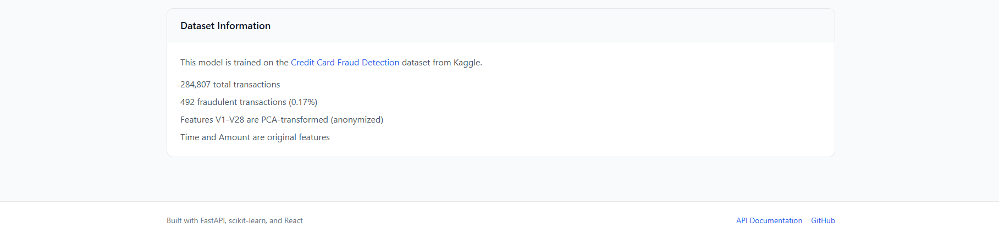

# Fraud Detection System

[](https://github.com/Nostradam4ik/fraud-detection-ml/actions/workflows/ci.yml)
[](https://www.python.org/downloads/)
[](https://fastapi.tiangolo.com)
[](https://reactjs.org)
[](https://web.dev/progressive-web-apps/)
[](#internationalization)
[](LICENSE)

A **machine learning-powered fraud detection system** for credit card transactions. Built with FastAPI, scikit-learn, and React. Features a Progressive Web App (PWA) with multi-language support and mobile-first design.

---

## Author

**Zhmuryk Andrii**

[](https://www.linkedin.com/in/andrii-zhmuryk-5a3a972b4/)

---

## Screenshots

### Dashboard


### Transaction Analyzer


### Prediction History


### Fraud Detection


### Model Information


### Feature Importance


### Dataset Information


---

## Features

### Core Features
- **Real-time Fraud Detection** - Predict fraud probability in milliseconds
- **Batch Processing** - Analyze multiple transactions via CSV upload
- **Model Insights** - View feature importance and performance metrics
- **Advanced Analytics** - Time series charts, trend analysis, and filters

### Progressive Web App (PWA)
- **Installable** - Add to home screen on mobile and desktop
- **Offline Support** - Service worker caching for offline functionality
- **Push Notifications** - Real-time fraud alerts
- **Background Sync** - Queue predictions when offline

### Internationalization (i18n)
- **Multi-language Support** - English, French, and Ukrainian
- **Easy Language Switching** - One-click language selector
- **Fully Translated UI** - All components support translations
- **Locale-aware Formatting** - Dates, numbers, and currencies

### Mobile-First Design
- **Responsive Layout** - Optimized for all screen sizes
- **Bottom Navigation** - Touch-friendly mobile navigation bar
- **Safe Area Support** - Proper handling for notched devices
- **44px Touch Targets** - Accessible touch interactions
- **Skeleton Loading** - Smooth loading states

### Security & Authentication
- **JWT Authentication** - Secure API with access and refresh tokens
- **Two-Factor Authentication (2FA)** - TOTP-based 2FA with QR code setup
- **Password Policies** - Strong password requirements with strength meter
- **Rate Limiting** - Protect API from abuse with configurable limits
- **Session Management** - View and revoke active sessions
- **Audit Logging** - Track all user actions for compliance

### Enterprise Features
- **Team Management** - Create teams, invite members, manage roles
- **Role-Based Access Control** - Admin, Analyst, and Viewer roles
- **Report Generation** - Export PDF/CSV reports with date filtering
- **Webhook Notifications** - Send real-time alerts to external systems
- **Email Alerts** - Get notified on fraud detection
- **GDPR Compliance** - Export/delete user data

### Performance Optimizations
- **Lazy Loading** - Code splitting for faster initial load
- **Vendor Chunking** - Separate bundles for better caching
- **API Response Caching** - In-memory cache with TTL
- **Optimized Bundle** - ES2020 target, tree shaking
- **Service Worker Caching** - Static assets cached for offline use

### Developer Experience
- **RESTful API** - Well-documented API with Swagger/OpenAPI
- **Interactive Dashboard** - React-based UI with dark mode
- **Docker Ready** - Easy deployment with Docker Compose
- **CI/CD Pipeline** - Automated testing with GitHub Actions
- **44 Unit Tests** - Comprehensive test coverage

## Tech Stack

### Backend
- **Python 3.11** - Core language
- **FastAPI** - High-performance API framework
- **SQLAlchemy** - ORM with SQLite/PostgreSQL
- **scikit-learn** - Machine learning (Random Forest)
- **python-jose** - JWT token handling
- **passlib + bcrypt** - Secure password hashing
- **pyotp** - TOTP for 2FA
- **slowapi** - Rate limiting
- **reportlab** - PDF generation
- **httpx** - Async HTTP for webhooks
- **pytest** - Testing framework (44 tests)

### Frontend
- **React 18** - UI framework
- **Vite** - Build tool with optimized chunking
- **TailwindCSS** - Styling with dark mode
- **Recharts** - Data visualization
- **Axios** - HTTP client with caching
- **Lucide React** - Icon library
- **Custom i18n** - Lightweight internationalization

### DevOps
- **Docker** - Containerization with multi-stage builds
- **GitHub Actions** - CI/CD pipeline
- **nginx** - Reverse proxy with caching headers
- **Kubernetes** - K8s manifests included

## Quick Start

### Prerequisites
- Python 3.11+
- Node.js 20+
- Docker (optional)

### 1. Clone the Repository

```bash
git clone https://github.com/Nostradam4ik/fraud-detection-ml.git
cd fraud-detection-ml
```

### 2. Download the Dataset

Download the [Credit Card Fraud Detection](https://www.kaggle.com/datasets/mlg-ulb/creditcardfraud) dataset from Kaggle and place `creditcard.csv` in `backend/data/`.

### 3. Setup Backend

```bash
cd backend

# Create virtual environment
python -m venv venv
source venv/bin/activate  # On Windows: venv\Scripts\activate

# Install dependencies
pip install -r requirements.txt

# Train the model
python ml/train.py

# Start the API
uvicorn app.main:app --reload
```

The API will be available at `http://localhost:8000`
- Swagger docs: `http://localhost:8000/docs`
- ReDoc: `http://localhost:8000/redoc`

### 4. Setup Frontend

```bash
cd frontend

# Install dependencies
npm install

# Start development server
npm run dev
```

The UI will be available at `http://localhost:5173`

### Docker Deployment

```bash
# Build and run with Docker Compose
docker-compose up --build

# Access the application
# Frontend: http://localhost
# API: http://localhost:8000
```

## Internationalization

The application supports multiple languages out of the box:

| Language | Code | Flag |
|----------|------|------|
| English | `en` | 🇺🇸 |
| French | `fr` | 🇫🇷 |
| Ukrainian | `ua` | 🇺🇦 |

### Adding a New Language

1. Create a new locale file: `frontend/src/i18n/locales/{code}.json`
2. Copy the structure from `en.json`
3. Translate all strings
4. Add the language to `frontend/src/i18n/index.jsx`:

```javascript
const languages = [
  { code: 'en', name: 'English', flag: '🇺🇸' },
  { code: 'fr', name: 'Français', flag: '🇫🇷' },
  { code: 'ua', name: 'Українська', flag: '🇺🇦' },
  { code: 'de', name: 'Deutsch', flag: '🇩🇪' }, // Add new language
];
```

### Using Translations in Components

```jsx
import { useI18n } from '../i18n/index.jsx';

function MyComponent() {
  const { t } = useI18n();

  return (
    <div>
      <h1>{t('dashboard.title')}</h1>
      <p>{t('common.loading')}</p>
    </div>
  );
}
```

## PWA Features

### Installation

The app can be installed on:
- **Desktop**: Chrome, Edge, Firefox (Add to Desktop)
- **Mobile**: iOS Safari (Add to Home Screen), Android Chrome

### Offline Support

The service worker caches:
- Static assets (JS, CSS, images)
- API responses (with network-first strategy)
- App shell for offline access

### Push Notifications

Enable push notifications to receive:
- Real-time fraud alerts
- Batch processing completion
- System updates

## API Endpoints

### Authentication
| Method | Endpoint | Description |
|--------|----------|-------------|
| `POST` | `/api/v1/auth/register` | Register a new user |
| `POST` | `/api/v1/auth/login` | Login with optional 2FA |
| `POST` | `/api/v1/auth/refresh` | Refresh access token |
| `POST` | `/api/v1/auth/logout` | Revoke refresh token |
| `GET` | `/api/v1/auth/me` | Get current user profile |
| `POST` | `/api/v1/auth/2fa/setup` | Setup 2FA (get QR code) |
| `POST` | `/api/v1/auth/2fa/verify` | Verify and enable 2FA |
| `POST` | `/api/v1/auth/2fa/disable` | Disable 2FA |
| `POST` | `/api/v1/auth/forgot-password` | Request password reset |
| `POST` | `/api/v1/auth/reset-password` | Reset password with token |
| `POST` | `/api/v1/auth/change-password` | Change current password |
| `GET` | `/api/v1/auth/sessions` | List active sessions |
| `DELETE` | `/api/v1/auth/sessions/{id}` | Revoke a session |
| `GET` | `/api/v1/auth/export-data` | Export all user data (GDPR) |

### Predictions
| Method | Endpoint | Description |
|--------|----------|-------------|
| `POST` | `/api/v1/predict` | Predict fraud for a transaction |
| `POST` | `/api/v1/predict/batch` | Batch prediction (JSON) |
| `POST` | `/api/v1/predict/upload-csv` | Batch prediction (CSV file) |
| `GET` | `/api/v1/predict/history` | Get prediction history |
| `GET` | `/api/v1/predict/stats` | Get user prediction stats |
| `GET` | `/api/v1/predict/sample/{type}` | Get sample transaction |

### Reports
| Method | Endpoint | Description |
|--------|----------|-------------|
| `GET` | `/api/v1/reports` | List generated reports |
| `POST` | `/api/v1/reports/generate` | Generate PDF/CSV report |
| `GET` | `/api/v1/reports/{id}` | Get report details |
| `GET` | `/api/v1/reports/{id}/download` | Download report file |

### Teams
| Method | Endpoint | Description |
|--------|----------|-------------|
| `GET` | `/api/v1/teams` | List user's teams |
| `POST` | `/api/v1/teams` | Create a new team |
| `GET` | `/api/v1/teams/{id}` | Get team details |
| `POST` | `/api/v1/teams/{id}/invite` | Invite member to team |
| `DELETE` | `/api/v1/teams/{id}/members/{user_id}` | Remove member |

### Webhooks
| Method | Endpoint | Description |
|--------|----------|-------------|
| `GET` | `/api/v1/webhooks` | List webhooks |
| `POST` | `/api/v1/webhooks` | Create webhook |
| `PUT` | `/api/v1/webhooks/{id}` | Update webhook |
| `DELETE` | `/api/v1/webhooks/{id}` | Delete webhook |
| `POST` | `/api/v1/webhooks/{id}/test` | Test webhook |

### Alerts
| Method | Endpoint | Description |
|--------|----------|-------------|
| `GET` | `/api/v1/alerts` | List email alerts |
| `POST` | `/api/v1/alerts` | Create alert rule |
| `PUT` | `/api/v1/alerts/{id}` | Update alert |
| `DELETE` | `/api/v1/alerts/{id}` | Delete alert |

### Admin (Admin role required)
| Method | Endpoint | Description |
|--------|----------|-------------|
| `GET` | `/api/v1/admin/users` | List all users |
| `GET` | `/api/v1/admin/stats` | System-wide statistics |
| `PUT` | `/api/v1/admin/users/{id}/role` | Update user role |
| `PUT` | `/api/v1/admin/users/{id}/status` | Activate/deactivate user |
| `GET` | `/api/v1/admin/audit-logs` | View audit logs |

### Analytics & Health
| Method | Endpoint | Description |
|--------|----------|-------------|
| `GET` | `/api/v1/analytics/stats` | API usage statistics |
| `GET` | `/api/v1/analytics/model` | Model information |
| `GET` | `/api/v1/analytics/features` | Feature importance |
| `GET` | `/api/v1/health` | Health check |
| `GET` | `/api/v1/rate-limit` | Current rate limit status |

### Example Request

```bash
curl -X POST "http://localhost:8000/api/v1/predict" \
  -H "Content-Type: application/json" \
  -d '{
    "time": 0,
    "v1": -1.359807, "v2": -0.072781, "v3": 2.536347,
    "v4": 1.378155, "v5": -0.338321, "v6": 0.462388,
    "v7": 0.239599, "v8": 0.098698, "v9": 0.363787,
    "v10": 0.090794, "v11": -0.551600, "v12": -0.617801,
    "v13": -0.991390, "v14": -0.311169, "v15": 1.468177,
    "v16": -0.470401, "v17": 0.207971, "v18": 0.025791,
    "v19": 0.403993, "v20": 0.251412, "v21": -0.018307,
    "v22": 0.277838, "v23": -0.110474, "v24": 0.066928,
    "v25": 0.128539, "v26": -0.189115, "v27": 0.133558,
    "v28": -0.021053, "amount": 149.62
  }'
```

### Example Response

```json
{
  "is_fraud": false,
  "fraud_probability": 0.0023,
  "confidence": "high",
  "risk_score": 0,
  "prediction_time_ms": 5.23
}
```

## Model Performance

The Random Forest model trained on the Kaggle dataset achieves:

| Metric | Score |
|--------|-------|
| Accuracy | 99.95% |
| Precision | 95.00% |
| Recall | 80.00% |
| F1 Score | 87.00% |
| ROC-AUC | 98.00% |

### Handling Class Imbalance

The dataset is highly imbalanced (0.17% fraud). We address this using:
- **SMOTE** (Synthetic Minority Over-sampling Technique)
- **Class weights** in the Random Forest algorithm

## Project Structure

```
fraud-detection-ml/
├── backend/
│   ├── app/
│   │   ├── api/routes/      # API endpoints (auth, predict, admin, etc.)
│   │   ├── core/            # Config, rate limiting, logging
│   │   ├── db/              # Database models and connection
│   │   ├── models/          # Pydantic schemas & ML model
│   │   └── services/        # Business logic (auth, teams, webhooks, etc.)
│   ├── ml/                  # Model training scripts
│   ├── tests/               # Unit tests (44 tests)
│   ├── logs/                # Application logs
│   └── Dockerfile
├── frontend/
│   ├── public/
│   │   ├── icons/           # PWA icons (SVG)
│   │   ├── manifest.json    # PWA manifest
│   │   └── sw.js            # Service worker
│   ├── src/
│   │   ├── components/      # React components
│   │   ├── i18n/            # Internationalization
│   │   │   ├── locales/     # Translation files (en, fr, ua)
│   │   │   └── index.jsx    # i18n context provider
│   │   ├── hooks/           # Custom React hooks
│   │   └── services/        # API client with caching
│   ├── vite.config.js       # Vite config with chunking
│   └── Dockerfile
├── k8s/                     # Kubernetes manifests
├── monitoring/              # Prometheus & Grafana configs
├── .github/workflows/       # CI/CD pipeline
├── docker-compose.yml
└── README.md
```

## Environment Variables

Create a `.env` file in the backend directory:

```env
# Required
SECRET_KEY=your-super-secret-key-here
DATABASE_URL=sqlite:///./fraud_detection.db

# Optional
DEBUG=false
LOG_LEVEL=INFO
CORS_ORIGINS=http://localhost:5173,http://localhost:3000
RATE_LIMIT_PER_MINUTE=60
ACCESS_TOKEN_EXPIRE_MINUTES=30
REFRESH_TOKEN_EXPIRE_DAYS=7

# Email (optional - for alerts)
SMTP_HOST=smtp.gmail.com
SMTP_PORT=587
SMTP_USER=your-email@gmail.com
SMTP_PASSWORD=your-app-password
```

## Development

### Running Tests

```bash
# Backend tests (44 tests)
cd backend
pytest tests/ -v

# With coverage
pytest tests/ -v --cov=app

# Frontend build
cd frontend
npm run build
```

### Code Quality

```bash
# Format Python code
black backend/app
isort backend/app

# Lint Python code
flake8 backend/app
```

### Frontend Build Analysis

The optimized build creates separate vendor chunks:

| Chunk | Size (gzip) | Description |
|-------|-------------|-------------|
| vendor-react | 45 KB | React core |
| vendor-recharts | 112 KB | Charts library |
| vendor-icons | 4 KB | Lucide icons |
| vendor-utils | 15 KB | Axios |
| index | 23 KB | App code |

## Deployment

### Railway (Free Tier)

1. Push your code to GitHub
2. Connect your repo to Railway
3. Deploy backend and frontend as separate services
4. Set environment variables

### Render (Free Tier)

1. Create a new Web Service for backend
2. Create a Static Site for frontend
3. Configure environment variables

### Docker Production

```bash
# Build optimized images
docker-compose -f docker-compose.prod.yml build

# Run with production settings
docker-compose -f docker-compose.prod.yml up -d
```

## Security Features

- **Password Policy**: Minimum 8 characters with uppercase, lowercase, digit, and special character
- **JWT Tokens**: Short-lived access tokens (30 min) with refresh token rotation
- **2FA**: TOTP-based two-factor authentication
- **Rate Limiting**: 60 requests/minute per user (configurable)
- **Audit Logging**: All actions logged with IP and user agent
- **CORS**: Configurable allowed origins
- **HTTPS Ready**: Works behind reverse proxy with HTTPS
- **CSP Headers**: Content Security Policy for XSS protection

## Browser Support

| Browser | Version |
|---------|---------|
| Chrome | 90+ |
| Firefox | 88+ |
| Safari | 14+ |
| Edge | 90+ |
| Mobile Safari | 14+ |
| Chrome Android | 90+ |

## License

**All Rights Reserved** - Copyright (c) 2024-2025 Zhmuryk Andrii

This project is protected by copyright. You may view this code for educational and reference purposes only. Any copying, modification, distribution, or commercial use is strictly prohibited without prior written permission from the author.

See the [LICENSE](LICENSE) file for full details.

## Contact

For permissions, collaborations, or job opportunities:

[](https://www.linkedin.com/in/andrii-zhmuryk-5a3a972b4/)

## Acknowledgments

- Dataset: [Credit Card Fraud Detection](https://www.kaggle.com/datasets/mlg-ulb/creditcardfraud) by ULB Machine Learning Group
- Inspired by real-world fraud detection systems used in banking

---

**Developed by Zhmuryk Andrii** | [LinkedIn](https://www.linkedin.com/in/andrii-zhmuryk-5a3a972b4/)
